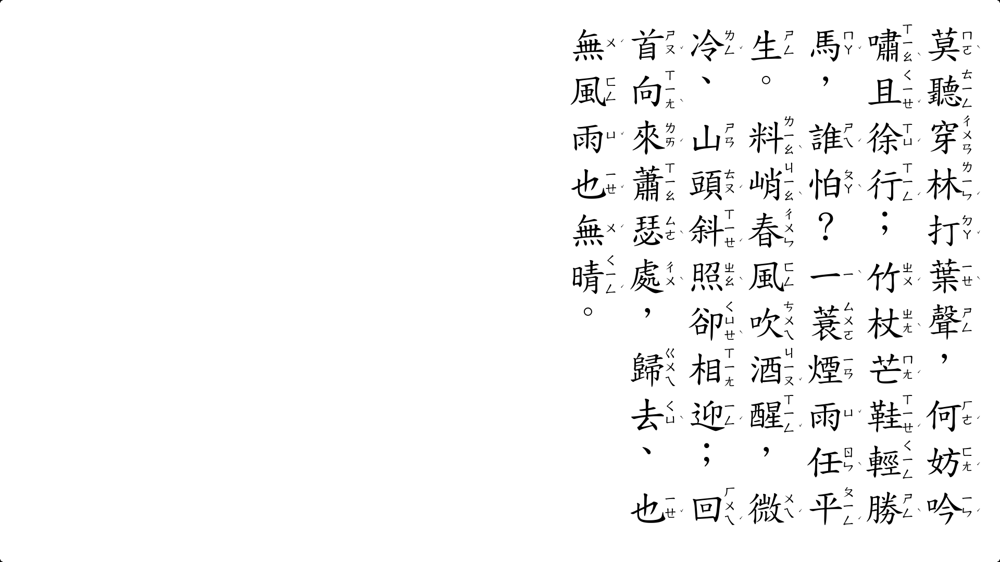
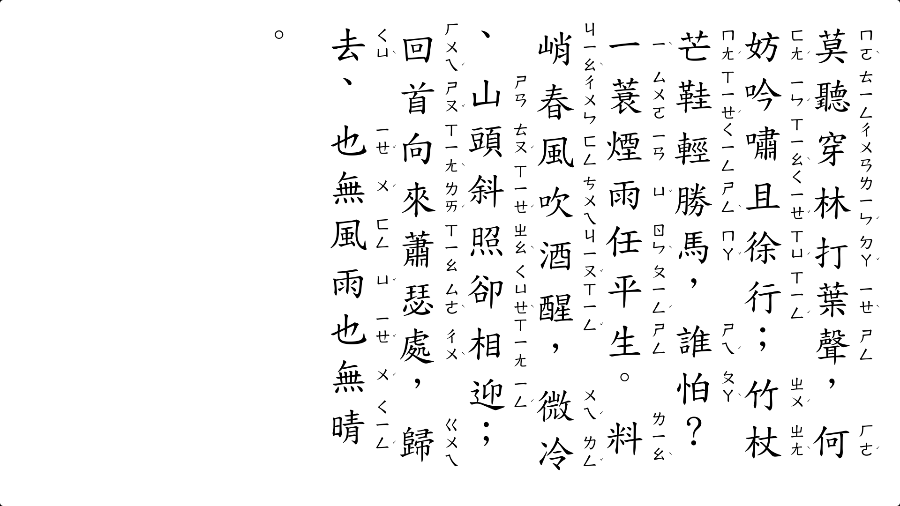
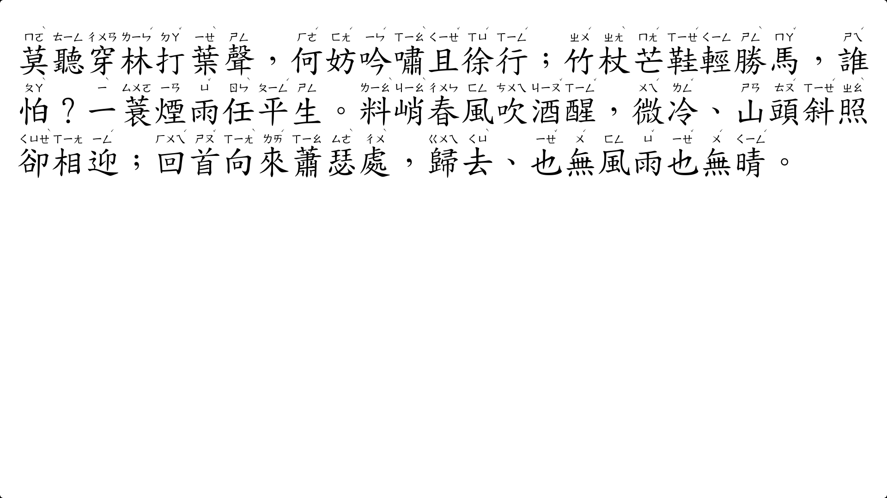
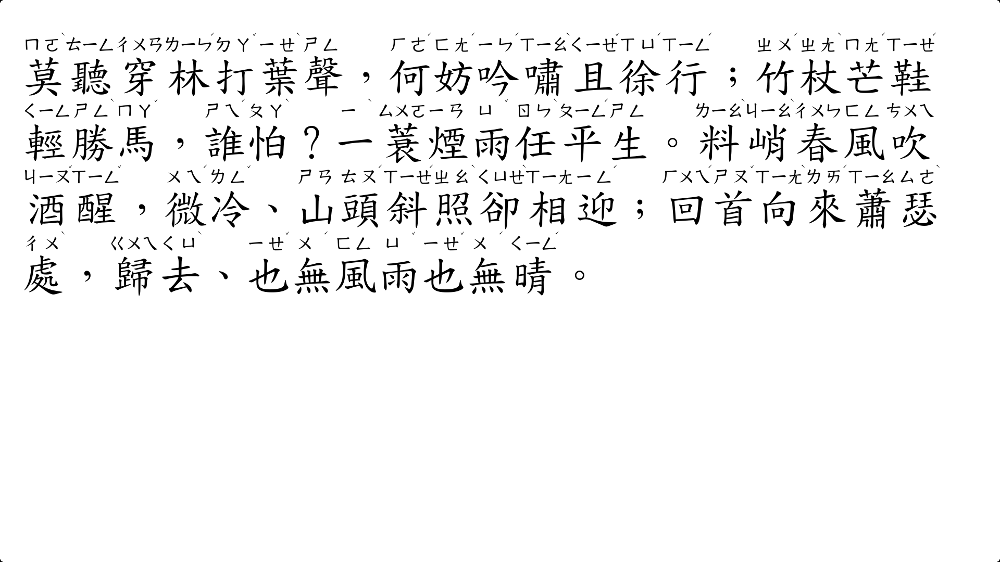
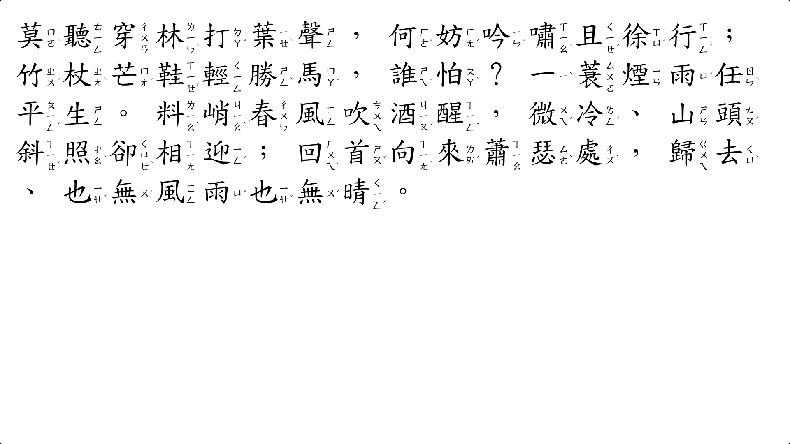
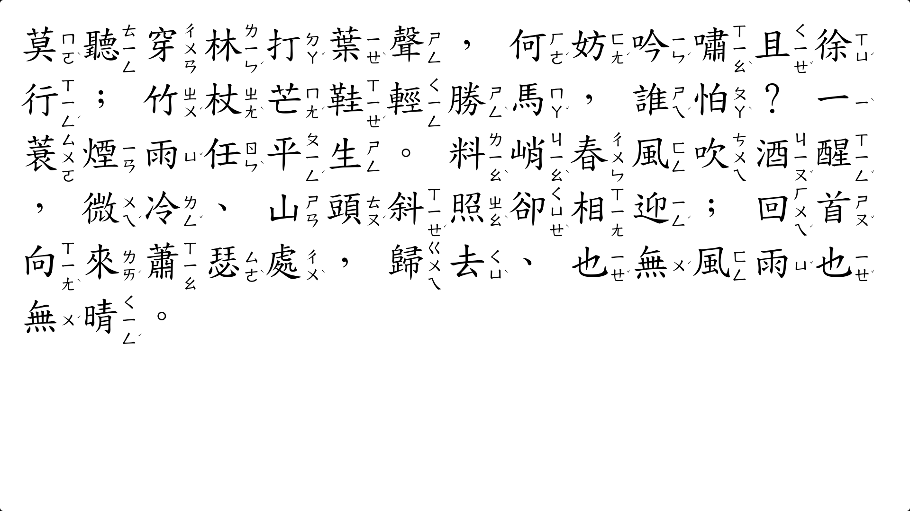

# webZhuyin: 以 HTML 幫文字加上注音

[程式連結]( https://xiaopanpankevinpan.github.io/webZhuyin/example_ruby.html )
[模組說明]( https://xiaopanpankevinpan.github.io/webZhuyin/usage ) <!-- i.e., "./usage.md" -->

## 為什麼需要 webZhuyin
近來，數位混成教育風行一時。然而作者發現，目前並未有使用簡便的文字加注音方案，能兼顧「跨瀏覽器相容性」與「檔案大小」。此程式／模組便是為了此目標設計。

## 優勢劣勢
- 注音字體的劣勢 <--> webZhuyin 的優勢
	- 多數注音字體需要付費取得授權，也容易衍生法律糾紛
		<--> webZhuyin 使用教育部正楷體、全字庫正楷體等字體，可避免多數情況下的法律糾紛。
	- 檢視者如果電腦沒有安裝注音字體，瀏覽器亦不支援 Web Fonts 方式載入（如版本過舊），則將看不到注音
		<--> webZhuyin 以網頁安全字體（多數電腦預裝）作為後備，減少不支援之情事。
	- 對於少見的、讀音特殊的破音字，注音字體可能沒有支援
		<--> webZhuyin 注什麼音，全可以自由決定。
	- 許多網站內建之編輯器，並無注音字體可供選擇
		<--> webZhuyin 只要編輯器支援 HTML 輸入，即可顯示帶注音之文字

- 帶注音之點陣圖片（.png, .jpg, .gif）的劣勢 <--> webZhuyin 的優勢
	- 圖片檔案大，傳輸用時久且耗流量
		<--> webZhuyin 只會產生 HTML 代碼，是純文字，故傳輸方便。且瀏覽器會自動快取字型檔，一勞永逸。
	- 許多網站內建之編輯器不支援圖片上傳
		<--> webZhuyin 只要編輯器支援 HTML 輸入，即可顯示帶注音之文字
	- 圖片放大就模糊／圖片上傳之後畫質變低了，結果注音不清楚
		<--> webZhuyin 所產生為 HTML 代碼，由瀏覽器依據放大倍率渲染，故文字清晰。

## 範例
### 直書
Firefox

Chrome

### 橫書，注音在上（貼近標準）
Firefox

Chrome

### 橫書，注音在用（貼近習慣）
Firefox

Chrome

